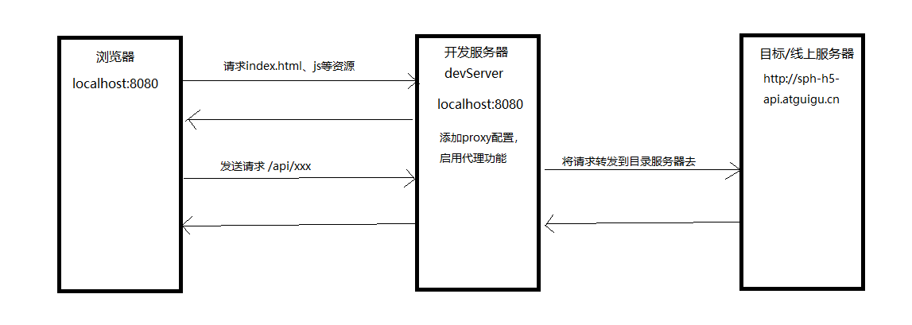

# day02

## Header 路由跳转

路由跳转两种方式：

1. 声明式导航 router-link

2. 编程式导航 this.$router.push/replace()

默认都会使用声明式导航（简单）

如果在路由跳转之前，要做一些其他的事（发送请求），必须用编程式导航

```html
<!-- 点击logo跳转首页 -->
<router-link to="/home">
  
</router-link>

<!-- 点击搜索按钮跳转搜索 -->
<!-- <form class="header__bottom-form">
  <input type="text" class="header__bottom-input" />
  <button class="header__bottom-btn" @click.prevent="toSearch">
    搜索
  </button>
</form> -->

<form class="header__bottom-form" @submit.prevent="toSearch">
  <input type="text" class="header__bottom-input" />
  <button class="header__bottom-btn">搜索</button>
</form>
```

## Footer 静态组件

### 1. 完成结构样式

```vue
<template>
  <div class="footer">
    <div class="footer__wrap">
      <div class="footer__list">
        <div class="footer__item">
          <span class="footer__item-title">购物指南</span>
          <span>购物流程</span>
          <span>会员介绍</span>
          <span>生活旅行/团购</span>
          <span>常见问题</span>
          <span>购物指南</span>
        </div>

        <div class="footer__item">
          <span class="footer__item-title">购物指南</span>
          <span>购物流程</span>
          <span>会员介绍</span>
          <span>生活旅行/团购</span>
          <span>常见问题</span>
          <span>购物指南</span>
        </div>

        <div class="footer__item">
          <span class="footer__item-title">购物指南</span>
          <span>购物流程</span>
          <span>会员介绍</span>
          <span>生活旅行/团购</span>
          <span>常见问题</span>
          <span>购物指南</span>
        </div>

        <div class="footer__item">
          <span class="footer__item-title">购物指南</span>
          <span>购物流程</span>
          <span>会员介绍</span>
          <span>生活旅行/团购</span>
          <span>常见问题</span>
          <span>购物指南</span>
        </div>

        <div class="footer__item">
          <span class="footer__item-title">帮助中心</span>
          
        </div>
      </div>
      <div class="footer__nav">
        <span>关于我们</span>
        <span>联系我们</span>
        <span>关于我们</span>
        <span>商家入驻</span>
        <span>营销中心</span>
        <span>友情链接</span>
        <span>关于我们</span>
        <span>商家入驻</span>
        <span>营销中心</span>
        <span>友情链接</span>
      </div>
      <span class="footer__address">地址：北京市昌平区宏福科技园综合楼6层</span>
      <span>京ICP备19006430号</span>
    </div>
  </div>
</template>

<script>
export default {
  name: "SFooter",
};
</script>

<style lang="less" scoped>
.footer {
  background-color: #eaeaea;
  padding: 20px 0;
  display: flex;
  justify-content: center;
  height: 270px;
  box-sizing: border-box;
}
.footer__wrap {
  min-width: 1200px;
  display: flex;
  flex-direction: column;
  align-items: center;
}
.footer__list {
  display: flex;
  justify-content: space-around;
  width: 100%;
  border-bottom: 1px solid #ccc;
  padding-bottom: 20px;
  margin-bottom: 20px;
}
.footer__item {
  display: flex;
  flex-direction: column;
}
.footer__item-title {
  font-size: 14px;
}
.footer__address {
  margin: 10px 0;
}

.footer__nav span {
  border-right: 1px solid #000;
  padding-right: 10px;
  margin-right: 10px;
  &:last-child {
    border-right: none;
    padding-right: 0;
    margin-right: 0;
  }
}
</style>
```

### 2. 希望 Footer 一直在底部

1. 让 Header 组件和 Footer 组件高度给一个整数

```css
.header__top {
  padding: 8px 0;
  background-color: #eaeaea;
  display: flex;
  justify-content: center;
  height: 20px;
}

.header__wrap {
  min-width: 1200px;
  display: flex;
  justify-content: space-between;
  align-items: center;
}
```

```css
.footer {
  background-color: #eaeaea;
  padding: 20px 0;
  display: flex;
  justify-content: center;
  height: 270px;
  box-sizing: border-box;
}
```

2. 定义中间容器的最小高度，此时就会将 footer 挤到底部去

```html
<div class="app-container">
  <router-view />
</div>
```

```css
.app-container {
  min-height: calc(100vh - 127px - 270px);
}
```

## TypeNav

### 1. 静态组件

1. 在 `vue-pc 项目资料\静态组件\Home 及其子组件_静态\TypeNav` 中引入组件

- components/TypeNav/index.vue

2. 在 Home 组件使用

```vue
<template>
  <div><TypeNav /></div>
</template>

<script>
import TypeNav from "@/components/TypeNav";

export default {
  name: "SHome",
  components: {
    TypeNav,
  },
};
</script>
```

### 2. 定义接口函数

1. 下载包

```
npm i axios
```

2. 定义接口函数

```js
// api/home.js
import axios from "axios";
// 获取首页三级分类列表
export const reqGetCategoryList = () => {
  return axios({
    method: "GET",
    url: "/api/product/getBaseCategoryList",
  });
};
```

### 3. 配置代理服务器解决跨域

```js
const { defineConfig } = require("@vue/cli-service");

module.exports = defineConfig({
  transpileDependencies: true,
  // 代理服务器解决跨域（只能在开发阶段使用）
  devServer: {
    proxy: {
      // 在devServer上添加代理功能
      // "/api" 处理以/api开头的请求
      "/api": {
        target: "http://sph-h5-api.atguigu.cn", // 将请求转发到哪个服务器去
        changeOrigin: true, // 允许跨域
        // 一开始请求地址：/api/xxx
        // 经过代理服务器转发后的地址：http://sph-h5-api.atguigu.cn/xxx
        // 看接口文档是否需要请求前缀
        // pathRewrite: {
        //   "^/api": "",
        // },
      },
    },
  },
});
```

> 扩展：代理服务器解决跨域原理图
>
> 

## 封装 axios 函数

### 1. 原因

未来发送请求都需要判断请求是否成功，非常麻烦，所以需要对 axios 进行封装，让发送请求处理更加简单

```js
try {
  // 请求成功，返回成功状态的promise对象
  // 请求失败，返回失败状态的promise对象
  const res = await reqGetCategoryList();
  // 处理请求成功
  // 判断功能是否成功
  if (res.data.code === 200) {
    // 功能成功
    console.log(res.data.data); // 成功数据
  } else {
    // 功能失败
    console.log(res.data.message); // 失败原因
  }
} catch (e) {
  // 处理请求失败
  console.log(e);
}
```

### 2. 封装 axios

1. 下包

```
npm i nprogress
```

2. 封装 utils/request.js

```js
/*
  封装axios函数：

    1. 成功就是成功，失败就是失败（请求失败、功能失败）
    2. 成功得到成功的数据，失败自动提示失败原因
    3. 复用请求地址 /api, 添加公共请求参数
    4. 失败提示的错误信息更准确
    5. 请求添加进度条提示
*/

import axios from "axios";
import NProgress from "nprogress";
import "nprogress/nprogress.css";

NProgress.configure({ showSpinner: false });

// 返回axios的“实例”
const request = axios.create({
  baseURL: "/api", // 请求基础路径（将来使用request发送请求，自动在请求地址前面添加baseURL）
  headers: {}, // 公共请求头
  timeout: 20000, // 请求超时时间（请求超过时间还未响应，就会自动中断请求报错）
});

/*
  const res = await request({ method: 'Get', url: '/xxx' });

  但我们使用request函数去发送请求的时候，整体触发流程
    1. request({ method: 'Get', url: '/xxx' })
    2. 触发请求拦截器（成功的回调）
    3. 内部发送请求
    4. 等响应结果回来，触发响应拦截器
      当响应状态码2xx，触发成功的回调（请求成功）
      当响应状态码非2xx，触发失败的回调（请求失败）
    5. 此时request函数执行完了，最后触发await后面的内容

      return Promise.resolve(config)
        .then(请求拦截器成功, 请求拦截器失败)
        .then(发送请求函数，undefined)
        .then(响应拦截器成功, 响应拦截器失败)
*/

const errMessages = {
  401: "未授权",
  403: "禁止访问",
  404: "资源找不到",
  407: "登录过期",
  500: "服务器错误",
};

// 请求拦截器
request.interceptors.request.use(
  // 成功的回调
  (config) => {
    // config 是发送请求的配置项
    // 作用：用来添加公共请求参数
    // config.headers.token = 'xxxx';

    // 开始进度条
    NProgress.start();

    // 必须返回配置项
    return config;
  }
  // 失败的回调
  // () => {}
);

// 响应拦截器
request.interceptors.response.use(
  // 成功的回调 --> 请求成功
  (response) => {
    // 结束进度条
    NProgress.done();
    /*
      response 响应对象
        headers
        config
        request
        data 成功的数据
        status
    */
    if (response.data.code === 200) {
      // 功能成功
      return response.data.data;
    } else {
      // 功能失败
      alert(response.data.message);
      return Promise.reject(response.data.message);
    }
  },
  // 失败的回调 --> 请求失败
  (error) => {
    // 结束进度条
    NProgress.done();
    /*
      请求失败
        error.message 失败原因
          请求超时：timeout of 10ms exceeded
          断网了：Network Error
        error.response.status 响应状态码

        error.response 有值，说明服务器有响应，响应结果是失败的
        error.response 没有值，说明请求在客户端就中断了（服务器没有返回响应），结果失败
    */
    let message = "未知错误，请联系客服解决";
    if (error.response) {
      // if (error.response.status === 404) {
      //   alert("访问资源不存在");
      // } else if (error.response.status === 500) {
      //   alert("服务器错误，请联系管理员解决");
      // }
      // alert(errMessages[error.response.status] || "未知错误，请联系客服解决");
      if (errMessages[error.response.status]) {
        message = errMessages[error.response.status];
      }
    } else {
      if (error.message.indexOf("timeout") > -1) {
        // 请求超时
        // alert("当前网络环境不稳定，请切换4/5G网络或WIFI网络试试");
        message = "当前网络环境不稳定，请切换4/5G网络或WIFI网络试试";
      } else if (error.message.indexOf("Network") > -1) {
        // 断网了
        // alert("没有检测到网络，请打开网络链接试试");
        message = "没有检测到网络，请打开网络链接试试";
      }
    }
    alert(message);
    return Promise.reject(message);
  }
);

export default request;
```

### 3. 使用封装的 axios

```js
import request from "@/utils/request";

export const reqGetCategoryList = () => {
  return request({
    method: "GET",
    // 不需要/api前缀了
    url: "/product/getBaseCategoryList",
  });
};
```

## 三级分类动态数据展示

### 1. 定义接口函数

```js
import request from "@/utils/request";
// 获取首页三级分类列表
export const reqGetCategoryList = () => {
  return request({
    method: "GET",
    url: "/product/getBaseCategoryList",
  });
};
```

### 2. 发送请求获取数据

```js
import { reqGetCategoryList } from "@/api/home";

export default {
  name: "TypeNav",
  data() {
    return {
      categoryList: [],
    };
  },
  async mounted() {
    const res = await reqGetCategoryList();
    this.categoryList = res.slice(0, 15);
  },
};
```

### 3. 数据动态展示

```html
<!-- 一级分类 -->
<div class="item" v-for="c1 in categoryList" :key="c1.categoryId">
  <h3>
    <a>{{ c1.categoryName }}</a>
  </h3>
  <div class="item-list clearfix">
    <!-- 二级分类 -->
    <div class="subitem" v-for="c2 in c1.categoryChild" :key="c2.categoryId">
      <dl class="fore">
        <dt>
          <a>{{ c2.categoryName }}</a>
        </dt>
        <dd>
          <!-- 三级分类 -->
          <em v-for="c3 in c2.categoryChild" :key="c3.categoryId">
            <a>{{ c3.categoryName }}</a>
          </em>
        </dd>
      </dl>
    </div>
  </div>
</div>
```
